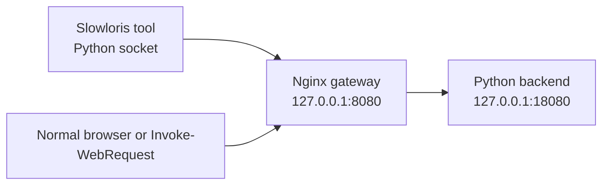

# 慢速攻击模拟与网关防御实践短报告

## 1. 实验范围

本报告面向本地授权实验环境，实验目标是用 Nginx（高性能 Web 服务器、反向代理和网关软件）作为网关，用 Python（解释型编程语言）实现后端服务和 Slowloris（慢速 HTTP 请求头攻击）模拟工具，观察默认基线与加固配置的差异。

安全边界：本实验只允许访问 `127.0.0.1`、`localhost` 或 `::1`。不得用于公网、第三方系统、生产系统或任何未授权目标。

## 2. 我的选择理由/我的理解

我选择 Slowloris，是因为它最直接地对应课程中“网关是入口控制点”的主线。Slowloris 不靠大流量打满带宽，而是利用 HTTP（HyperText Transfer Protocol，超文本传输协议）请求头迟迟不结束这一点，让网关在 Ingress（入口/入站接入层）持续保留连接和读取状态。

我的理解是：这类攻击的重点不是后端业务逻辑，而是入口层资源管理。只要网关持续等待一批“看起来还没发完”的请求，连接、worker（工作进程）可处理能力、日志和正常请求都会受到影响。因此防御也要回到入口生命周期：缩短等待、限制单个来源可占用的连接数，并让日志能看出超时和拒绝。

## 3. 实验架构



组件说明：

| 组件 | 作用 |
| --- | --- |
| `backend/app.py` | 本地后端服务，提供 `/health` 和简单响应。 |
| `attack/slowloris.py` | 本地 Slowloris 模拟工具，默认低强度并限制本地目标。 |
| `nginx/conf/nginx-baseline.conf` | 未加固基线配置，用于观察慢速连接占用。 |
| `nginx/conf/nginx-hardened.conf` | 加固配置，只使用 Nginx 原生命令。 |
| `scripts/*.ps1` | Windows（Microsoft Windows，微软桌面操作系统）运行辅助脚本。 |

## 4. 运行环境说明

当前自动检查结果：

| 项目 | 状态 |
| --- | --- |
| Python | 已检测到 Python 3.12.13。 |
| Docker | 未检测到，且本次不使用 Docker（开源容器化平台）。 |
| Nginx | 已确认 Windows 版 Nginx，路径为 `C:\nginx-1.31.2`，版本为 `nginx/1.31.2`。 |

因此，本阶段已交付源码、配置、脚本和复现实验步骤，并已完成基线配置与加固配置的 Nginx 语法测试。实际攻击现象仍需要按 README 在本机运行后补充，不能编造。

## 5. 攻击现象记录

### 5.1 基线配置下应观察的现象

在 `nginx-baseline.conf` 下运行 Slowloris 工具后，预期可以观察到：

1. 攻击工具输出已打开的慢连接数量，并定期显示仍然存活的连接数。
2. Nginx 需要等待未完成的请求头，请求不会马上进入后端。
3. `nginx/logs/access.log` 中这类未完成请求通常不会立即形成完整访问记录。
4. Windows 的 `Get-NetTCPConnection` 可看到指向 `127.0.0.1:8080` 的 TCP（Transmission Control Protocol，传输控制协议）连接增加。
5. 当连接数接近网关可承载上限时，正常 `/health` 请求可能变慢、失败或排队。

需要本机运行后补充的实际记录：

| 记录项 | 结果 |
| --- | --- |
| 基线启动时间 | 待运行后填写 |
| Slowloris 参数 | 默认：30 连接，10 秒间隔，60 秒持续时间 |
| 慢连接存活情况 | 待运行后填写 |
| 正常请求表现 | 待运行后填写 |
| Nginx 日志片段 | 待运行后填写 |

### 5.2 加固配置下应观察的现象

在 `nginx-hardened.conf` 下重新运行同样攻击后，预期可以观察到：

1. 慢连接更快被关闭，因为 `client_header_timeout` 缩短了请求头读取等待时间。
2. 同一来源占用连接超过 `limit_conn` 限制时，Nginx 会拒绝超限连接。
3. 正常 `/health` 请求更容易保持可用。
4. `nginx/logs/error.log` 中可能出现连接限制或请求超时相关信息。

需要本机运行后补充的实际记录：

| 记录项 | 结果 |
| --- | --- |
| 加固配置启动时间 | 待运行后填写 |
| 慢连接关闭速度 | 待运行后填写 |
| 超限连接表现 | 待运行后填写 |
| 正常请求表现 | 待运行后填写 |
| Nginx 日志片段 | 待运行后填写 |

## 6. Slowloris 攻击原理

Slowloris 的核心是让 HTTP 请求头保持“未完成”状态。正常 HTTP 请求头会以空行结束，也就是 `\r\n\r\n`。Slowloris 只发送请求行和部分请求头，然后隔一段时间补发一小段头部字段，但一直不发送结束空行。

这样做的效果是：

1. 网关认为客户端仍在发送请求头。
2. 连接不能立即释放。
3. 如果慢连接数量足够多，网关入口层资源会被消耗。
4. 后端服务可能还没收到请求，但入口已经被拖住。

这正好对应课程里“网关既是防线，也是攻击目标”的判断。攻击者不一定要突破后端，只要让入口层长期忙于等待，就可能影响整体可用性。

## 7. 防御配置与原理

本次只使用 Nginx 原生配置。

### 7.1 基线配置

基线文件：`nginx/conf/nginx-baseline.conf`

基线配置只做本地反向代理，不加入慢速攻击防护：

```nginx
server {
    listen       127.0.0.1:8080;
    server_name  localhost;

    location / {
        proxy_http_version 1.1;
        proxy_set_header Host $host;
        proxy_set_header X-Real-IP $remote_addr;
        proxy_set_header X-Forwarded-For $proxy_add_x_forwarded_for;
        proxy_set_header Connection "";
        proxy_pass http://local_backend;
    }
}
```

### 7.2 加固配置

加固文件：`nginx/conf/nginx-hardened.conf`

核心配置：

```nginx
client_header_timeout  5s;
client_body_timeout    10s;
keepalive_timeout      10s;
reset_timedout_connection on;

limit_conn_zone $binary_remote_addr zone=perip:10m;
limit_conn_status 429;

server {
    listen 127.0.0.1:8080;
    limit_conn perip 10;
}
```

配置解释：

| 指令 | 防御作用 |
| --- | --- |
| `client_header_timeout` | 缩短读取客户端请求头的等待时间，针对 Slowloris 的“请求头迟迟不结束”。 |
| `client_body_timeout` | 控制请求体读取超时，主要用于扩展防御 Slow POST（慢速 HTTP POST 请求体攻击）。 |
| `keepalive_timeout` | 缩短空闲长连接保留时间，减少空闲连接占用。 |
| `reset_timedout_connection` | 对超时连接直接复位，加快清理。 |
| `limit_conn_zone` 和 `limit_conn` | 按 IP（Internet Protocol，互联网协议）限制并发连接数，防止单一来源占满入口连接。 |
| `limit_conn_status` | 指定连接数超限时返回的状态码，便于日志识别。 |

## 8. 防御前后对比

| 维度 | 基线配置 | 加固配置 |
| --- | --- | --- |
| 请求头读取等待 | 使用默认行为，慢请求头可能占用更久。 | `client_header_timeout 5s` 更快释放慢连接。 |
| 单来源连接占用 | 未显式限制。 | `limit_conn perip 10` 限制单个来源并发连接。 |
| 空闲连接保留 | `keepalive_timeout 65`。 | `keepalive_timeout 10s`。 |
| 慢请求清理 | 依赖默认超时。 | 超时连接可被更快复位。 |
| 可观测性 | 有访问日志和错误日志。 | 日志中更容易看到超时或连接限制。 |

## 9. 可观测性指标接口预留

本次选做项暂不完整实现，但已预留：

| 文件 | 作用 |
| --- | --- |
| `scripts/collect-metrics.ps1` | 采集本地 `8080` 端口 TCP 连接数量。 |
| `observability/metrics-template.csv` | CSV（Comma-Separated Values，逗号分隔值）指标模板。 |
| `observability/notes.md` | 指标说明。 |

后续可补充的核心指标：

1. `127.0.0.1:8080` TCP 连接总数和已建立连接数。
2. 正常 `/health` 请求成功率和耗时。
3. Nginx access log（访问日志）状态码分布。
4. Nginx error log（错误日志）中的超时、连接限制记录。
5. Python 后端是否收到请求，以及收到请求的时间。

## 10. 不足与后续扩展

1. 已确认 `C:\nginx-1.31.2\nginx.exe` 可用，且两个 Nginx 配置语法测试通过；实际攻击现象仍需要本机运行后补充，不能编造。
2. 资源曲线是选做项，本阶段只预留接口。
3. 本次只实现 Slowloris；Slow POST 和 TLS（Transport Layer Security，传输层安全协议）慢握手可作为扩展方向。
4. 防御仅使用 Nginx 原生配置，未使用系统防火墙、WAF（Web Application Firewall，Web 应用防火墙）或第三方清洗能力。

## 11. 生成依据和人工待检查点

生成依据：

1. `Source-A.html` 课件中关于网关入口价值、通用架构、Slowloris 风险和课后作业要求的内容。
2. 第二阶段确认结果：选择 Slowloris、使用 Python、Windows 本机部署、报告使用 Markdown、防御只使用 Nginx 原生配置。
3. 第三阶段技术方案：拆分基线配置和加固配置，保留攻击工具默认安全限制，选做项先预留接口。
4. Nginx 官方文档中关于请求头超时、请求体超时、长连接超时、连接数限制和请求限速模块的说明。

人工待检查点：

| 检查点 | 状态 |
| --- | --- |
| 本机是否已安装 Nginx Windows 版 | 已确认：`C:\nginx-1.31.2`，版本 `nginx/1.31.2`。 |
| `nginx-baseline.conf` 是否能在本机启动 | 语法测试已通过；完整启动与攻击现象待运行后确认。 |
| `nginx-hardened.conf` 是否能在本机启动 | 语法测试已通过；完整启动与攻击现象待运行后确认。 |
| 基线攻击现象是否已按表格补充 | 待运行后填写 |
| 加固后防御效果是否已按表格补充 | 待运行后填写 |
| 是否补做资源曲线 | 必做完成后再考虑 |
| 是否仍存在公司名、人名、客户名或内部路径 | 本阶段已做静态脱敏检查，交付前仍建议人工复核 |

## 12. 参考资料

- 课程材料 `Source-A.html`：已脱敏引用其“网关是边界上的控制点”和“网关既是防线，也是攻击目标”的主线。
- Nginx 官方核心模块文档：<https://nginx.org/en/docs/http/ngx_http_core_module.html>
- Nginx 官方连接限制模块文档：<https://nginx.org/en/docs/http/ngx_http_limit_conn_module.html>
- Nginx 官方请求限速模块文档：<https://nginx.org/en/docs/http/ngx_http_limit_req_module.html>

