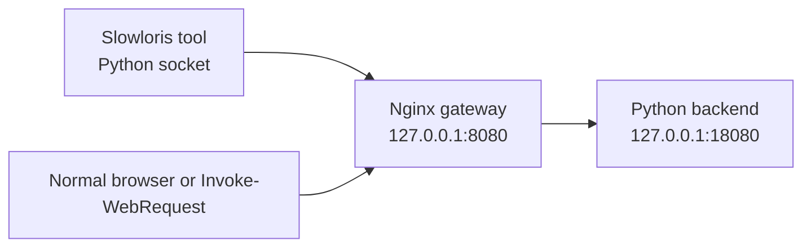

# 慢速攻击模拟与网关防御实践短报告

## 1. 实验范围

本报告面向本地授权实验环境，实验目标是用 Nginx（高性能 Web 服务器、反向代理和网关软件）作为网关，用 Python（解释型编程语言）实现后端服务和 Slowloris（慢速 HTTP 请求头攻击）模拟工具，观察默认基线与加固配置的差异。

安全边界：本实验只允许访问 `127.0.0.1`、`localhost` 或 `::1`。不得用于公网、第三方系统、生产系统或任何未授权目标。

## 2. 我的选择理由/我的理解

我选择 Slowloris，是因为它最直接地对应课程中“网关是入口控制点”的主线。Slowloris 不靠大流量打满带宽，而是利用 HTTP（HyperText Transfer Protocol，超文本传输协议）请求头迟迟不结束这一点，让网关在 Ingress（入口/入站接入层）持续保留连接和读取状态。

我的理解是：这类攻击的重点不是后端业务逻辑，而是入口层资源管理。只要网关持续等待一批“看起来还没发完”的请求，连接、worker（工作进程）可处理能力、日志和正常请求都会受到影响。因此防御也要回到入口生命周期：缩短等待、限制单个来源可占用的连接数，并让日志能看出超时和拒绝。

## 3. 实验架构



组件说明：

| 组件 | 作用 |
| --- | --- |
| `backend/app.py` | 本地后端服务，提供 `/health` 和简单响应。 |
| `attack/slowloris.py` | 本地 Slowloris 模拟工具，默认低强度并限制本地目标。 |
| `nginx/conf/nginx-baseline.conf` | 未加固基线配置，用于观察慢速连接占用。 |
| `nginx/conf/nginx-hardened.conf` | 加固配置，只使用 Nginx 原生命令。 |
| `scripts/*.ps1` | Windows（Microsoft Windows，微软桌面操作系统）运行辅助脚本。 |

## 4. 运行环境说明

当前自动检查结果：

| 项目 | 状态 |
| --- | --- |
| Python | 已检测到 Python 3.12.13。 |
| Docker | 未检测到，且本次不使用 Docker（开源容器化平台）。 |
| Nginx | 已确认 Windows 版 Nginx，路径为 `C:\nginx-1.31.2`，版本为 `nginx/1.31.2`。 |

因此，本阶段已交付源码、配置、脚本和复现实验步骤，并已完成基线配置与加固配置的 Nginx 语法测试。随后已在本机自动运行一轮基线与加固对照测试，测试结果记录在第 5、8、9 节

 攻击现象记录

### 5.1 本次自动测试日志位置

有效测试数据以以下两个目录为准：

| 阶段 | 日志目录 |
| --- | --- |
| 基线配置 | `observability/20260708-174426-baseline/` |
| 加固配置 | `observability/20260708-174607-hardened/` |

说明：首次合并跑测试时发现 `scripts/stop-nginx.ps1` 没有带 `-c` 指定项目配置，可能导致后续加固组仍受前一次 Nginx 进程影响。该脚本已修正，并重新分开运行基线组和加固组；因此本报告只采用上表两个有效目录的数据。

### 5.2 基线配置下的实际观察结果

在 `nginx-baseline.conf` 下运行 Slowloris 工具后，观察到慢连接可以长期占住 Nginx 入口连接。测试持续 35 秒期间，攻击工具 4 轮检查均显示 60 个慢连接仍然存活；TCP 连接数也稳定维持在较高水平。

| 记录项 | 结果 |
| --- | --- |
| 基线启动时间 | 2026-07-08 17:44:52 左右。 |
| Slowloris 参数 | 目标 `127.0.0.1:8080`；60 个连接；每 10 秒补发一次头部；持续 35 秒。 |
| 慢连接存活情况 | `baseline-attack.log` 显示 4 轮均为 `alive=60`、`failed_since_last_round=0`。 |
| TCP 连接指标 | `baseline-metrics.csv` 显示 `tcp_connections_total=63`、`tcp_connections_established=62`，从 17:44:52 到 17:45:27 基本不下降。 |
| 正常请求表现 | `baseline-health.csv` 中 7 次 `/health` 均返回 `200`，耗时约 21-65 ms。 |
| Nginx 日志片段 | 测试结束后攻击脚本主动关闭慢连接，`access.log` 出现 `400`，`request_time` 约 40 秒；`error.log` 出现 `client prematurely closed connection while reading client request headers`。 |

我的理解：基线配置不是完全“不能用”，因为这次本机低强度测试下 `/health` 仍然正常；但它让 60 个未完成请求头持续占用连接，说明入口层已经被慢请求拖住。如果连接数继续增大，正常请求就更容易排队、变慢或失败。

### 5.3 加固配置下的实际观察结果

在 `nginx-hardened.conf` 下重新运行同样攻击后，慢连接被 Nginx 主动清理。第一轮还能看到 60 个连接，第二轮已经全部失败，攻击工具输出 `All slow connections were closed by the server.`。

| 记录项 | 结果 |
| --- | --- |
| 加固配置启动时间 | 2026-07-08 17:46:20 左右。 |
| 慢连接关闭速度 | `hardened-attack.log` 显示第 1 轮 `alive=60`，第 2 轮 `alive=0`、`failed_since_last_round=60`。 |
| TCP 连接指标 | `hardened-metrics.csv` 显示 17:46:20 为 `total=63`、`established=62`，到 17:46:27 已降为 `total=3`、`established=2`，之后维持在 1-2 个已建立连接。 |
| 超限连接表现 | 本轮主要由 `client_header_timeout 5s` 触发清理；未观察到 `limit_conn` 成为主导现象。 |
| 正常请求表现 | `hardened-health.csv` 中 7 次 `/health` 均返回 `200`，耗时约 22-62 ms。 |
| Nginx 日志片段 | `access.log` 出现 `408`，`request_time` 约 5.0 秒；`error.log` 出现 `client timed out ... while reading client request headers`。 |

我的理解：这次加固最明显生效的是 `client_header_timeout 5s`。Slowloris 的关键是“请求头一直不结束”，所以缩短请求头读取等待时间后，Nginx 不再长期陪这些连接等待，而是在约 5 秒后记录 408 并释放资源

 Slowloris 攻击原理

Slowloris 的核心是让 HTTP 请求头保持“未完成”状态。正常 HTTP 请求头会以空行结束，也就是 `\r\n\r\n`。Slowloris 只发送请求行和部分请求头，然后隔一段时间补发一小段头部字段，但一直不发送结束空行。

这样做的效果是：

1. 网关认为客户端仍在发送请求头。
2. 连接不能立即释放。
3. 如果慢连接数量足够多，网关入口层资源会被消耗。
4. 后端服务可能还没收到请求，但入口已经被拖住。

这正好对应课程里“网关既是防线，也是攻击目标”的判断。攻击者不一定要突破后端，只要让入口层长期忙于等待，就可能影响整体可用性。

## 7. 防御配置与原理

本次只使用 Nginx 原生配置。

### 7.1 基线配置

基线文件：`nginx/conf/nginx-baseline.conf`

基线配置只做本地反向代理，不加入慢速攻击防护：

```nginx
server {
    listen       127.0.0.1:8080;
    server_name  localhost;

    location / {
        proxy_http_version 1.1;
        proxy_set_header Host $host;
        proxy_set_header X-Real-IP $remote_addr;
        proxy_set_header X-Forwarded-For $proxy_add_x_forwarded_for;
        proxy_set_header Connection "";
        proxy_pass http://local_backend;
    }
}
```

### 7.2 加固配置

加固文件：`nginx/conf/nginx-hardened.conf`

核心配置：

```nginx
client_header_timeout  5s;
client_body_timeout    10s;
keepalive_timeout      10s;
reset_timedout_connection on;

limit_conn_zone $binary_remote_addr zone=perip:10m;
limit_conn_status 429;

server {
    listen 127.0.0.1:8080;
    limit_conn perip 10;
}
```

配置解释：

| 指令 | 防御作用 |
| --- | --- |
| `client_header_timeout` | 缩短读取客户端请求头的等待时间，针对 Slowloris 的“请求头迟迟不结束”。 |
| `client_body_timeout` | 控制请求体读取超时，主要用于扩展防御 Slow POST（慢速 HTTP POST 请求体攻击）。 |
| `keepalive_timeout` | 缩短空闲长连接保留时间，减少空闲连接占用。 |
| `reset_timedout_connection` | 对超时连接直接复位，加快清理。 |
| `limit_conn_zone` 和 `limit_conn` | 按 IP（Internet Protocol，互联网协议）限制并发连接数，防止单一来源占满入口连接。 |
| `limit_conn_status` | 指定连接数超限时返回的状态码，便于日志识别。 |

## 8. 防御前后对比

| 维度 | 基线配置实测 | 加固配置实测 |
| --- | --- | --- |
| 请求头读取等待 | 60 个慢连接在 35 秒测试期间持续存活，最后由攻击脚本关闭。 | 约 5 秒触发请求头读取超时，第二轮检查时 60 个慢连接已全部关闭。 |
| 单来源连接占用 | 未显式限制，TCP 已建立连接稳定在 62 左右。 | 连接数从 62 个已建立连接快速降到约 1-2 个。 |
| 空闲连接保留 | 默认 `keepalive_timeout 65`。 | `keepalive_timeout 10s`，减少空闲连接占用时间。 |
| 慢请求清理 | 依赖默认超时，短时间内看不到主动清理效果。 | `client_header_timeout 5s` 成为本轮主要防护动作。 |
| 正常请求可用性 | 7 次 `/health` 均为 200，耗时约 21-65 ms。 | 7 次 `/health` 均为 200，耗时约 22-62 ms。 |
| 可观测性 | 结束后可看到 400 和客户端提前关闭日志。 | 可看到 408 和请求头读取超时日志，定位更直接。 |

结论：本次本机低强度实验中，正常请求在两组配置下都保持成功；真正的差异在于慢连接生命周期。基线组让慢连接持续占用入口连接，加固组把未完成请求头限制在约 5 秒内，从而更快释放 Nginx 资源

 可观测性指标记录

本次已采集基础指标，未绘制资源曲线，但 CSV 可以直接导入 Excel 或其他工具生成折线图。

| 指标文件 | 记录内容 | 本次观察 |
| --- | --- | --- |
| `observability/20260708-174426-baseline/baseline-metrics.csv` | 基线组 8080 端口 TCP 连接数 | 总连接数稳定为 63，已建立连接稳定为 62。 |
| `observability/20260708-174426-baseline/baseline-health.csv` | 基线组 `/health` 状态码和耗时 | 7 次均为 200，耗时 21-65 ms。 |
| `observability/20260708-174607-hardened/hardened-metrics.csv` | 加固组 8080 端口 TCP 连接数 | 已建立连接从 62 快速降到 1-2。 |
| `observability/20260708-174607-hardened/hardened-health.csv` | 加固组 `/health` 状态码和耗时 | 7 次均为 200，耗时 22-62 ms。 |
| `nginx/logs/access.log` | Nginx 访问日志 | 基线组出现约 40 秒 `400`；加固组出现约 5 秒 `408`。 |
| `nginx/logs/error.log` | Nginx 错误日志 | 基线组为客户端提前关闭；加固组为读取请求头超时。 |

用于发现和定位此类攻击的核心指标：

1. `127.0.0.1:8080` TCP 连接总数和已建立连接数是否异常升高。
2. 正常 `/health` 请求成功率和耗时是否恶化。
3. Nginx access log 中 `408`、`400`、`429` 等状态码是否集中出现。
4. Nginx error log 中是否集中出现 `while reading client request headers`、`client timed out`、`limiting connections` 等关键词。
5. 后端日志是否没有同步增长；如果入口连接很多但后端请求很少，说明压力主要卡在网关入口层

 不足与后续扩展

1. 本次已完成一轮本地自动验证；未绘制资源曲线，但已生成 CSV，可后续导入 Excel 绘图。
2. 为避免本机负载过高，本次采用 60 个慢连接、35 秒持续时间，没有做更高强度或长时间压测。
3. 本次只实现 Slowloris；Slow POST 和 TLS（Transport Layer Security，传输层安全协议）慢握手可作为扩展方向。
4. 防御仅使用 Nginx 原生配置，未使用系统防火墙、WAF（Web Application Firewall，Web 应用防火墙）或第三方清洗能力

 生成依据和人工待检查点

生成依据：

1. `Source-A.html` 课件中关于网关入口价值、通用架构、Slowloris 风险和课后作业要求的内容。
2. 第二阶段确认结果：选择 Slowloris、使用 Python、Windows 本机部署、报告使用 Markdown、防御只使用 Nginx 原生配置。
3. 第三阶段技术方案：拆分基线配置和加固配置，保留攻击工具默认安全限制，选做项先预留接口。
4. Nginx 官方文档中关于请求头超时、请求体超时、长连接超时、连接数限制和请求限速模块的说明。
5. 2026-07-08 本机自动测试日志：`observability/20260708-174426-baseline/` 与 `observability/20260708-174607-hardened/`。

人工待检查点：

| 检查点 | 状态 |
| --- | --- |
| 本机是否已安装 Nginx Windows 版 | 已确认：`C:\nginx-1.31.2`，版本 `nginx/1.31.2`。 |
| `nginx-baseline.conf` 是否能在本机启动 | 已完成：语法测试通过，并完成基线攻击验证。 |
| `nginx-hardened.conf` 是否能在本机启动 | 已完成：语法测试通过，并完成加固攻击验证。 |
| 基线攻击现象是否已按表格补充 | 已完成：慢连接 35 秒内持续存活，TCP 已建立连接约 62。 |
| 加固后防御效果是否已按表格补充 | 已完成：约 5 秒清理慢连接，日志出现 408 和请求头读取超时。 |
| 是否补做资源曲线 | 选做项：本次已保留 CSV，未绘制曲线图。 |
| 是否仍存在公司名、人名、客户名或内部路径 | 本阶段已做静态脱敏检查，交付前仍建议人工复核。 

 参考资料

- 课程材料 `Source-A.html`：已脱敏引用其“网关是边界上的控制点”和“网关既是防线，也是攻击目标”的主线。
- Nginx 官方核心模块文档：<https://nginx.org/en/docs/http/ngx_http_core_module.html>
- Nginx 官方连接限制模块文档：<https://nginx.org/en/docs/http/ngx_http_limit_conn_module.html>
- Nginx 官方请求限速模块文档：<https://nginx.org/en/docs/http/ngx_http_limit_req_module.html>


